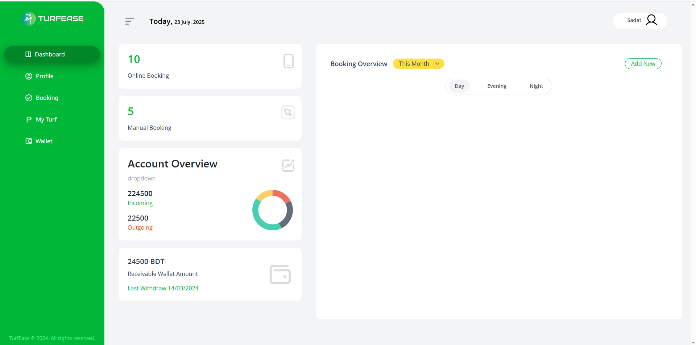
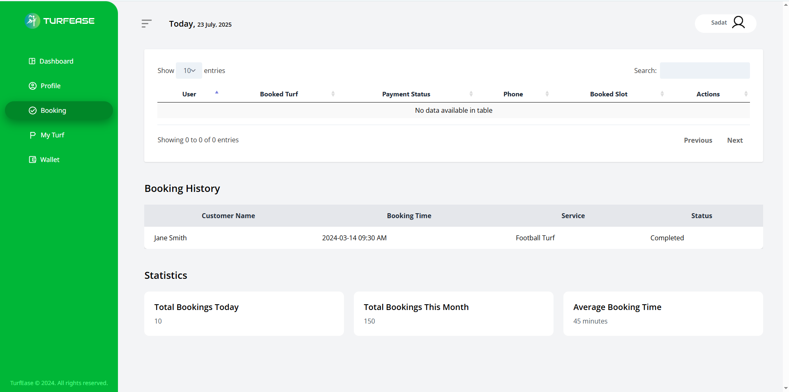

# Turfease – Turf / Sports Field Booking Web Application

**Turfease** is a web application designed to simplify the process of booking sports turfs and fields. Whether you're an individual looking for a play slot or a turf manager handling reservations — Turfease brings everything under one platform.

---

## Project Lookup

### Homepage

   

### Turf List Page


### Admin Panel

 

### Turf Manager Panel

  

---

## Technologies Used

-   **PHP** (Laravel Framework)
-   **JavaScript**
-   **HTML5**
-   **CSS3**
-   **Tailwind CSS**
-   **MySQL**

---

## How to Run the Project

Follow the steps below to set up and run Turfease locally:

---

### Step 1: Clone the Project

```
git clone https://github.com/caughtonthecode/turf-ease.git
cd turfease
```

### Step 2: Open the Project in a Code Editor

Use VS Code, PHPStorm, or any preferred editor.

### Step 3: Step 3: Install Composer

If Composer is not installed:
Windows:
Download installer from: https://getcomposer.org/download

Run and follow the setup

Now, install Laravel dependencies:

```
composer install
```

### Step 4: Install Node Modules

```
npm install
```

### Step 5: Set Up XAMPP and the Database

Download and install XAMPP from https://www.apachefriends.org

Start Apache and MySQL from XAMPP control panel

Create a new database named: <b> turfease </b>

### Step 6: Configure the Environment File

```
cp .env.example .env
```

Edit .env and set your database credentials:

```
DB_DATABASE=turfease
DB_USERNAME=root
DB_PASSWORD=
```

### Step 7: Generate App Key

```
php artisan key:generate
```

### Step 8: Migrate the Database

```
php artisan migrate:fresh
```

If you see an error, make sure your database name matches and MySQL is running.

### Step 9: Run the Frontend Build

```
npm run dev
```

This will compile Tailwind and other frontend assets.

### Step 10: Serve the Laravel Project

Open a second terminal and run:

```
php artisan serve
```

The Project will be start running

Go to your browser and visit:

```
http://localhost:8000
```

### Enjoy!

Thank You
